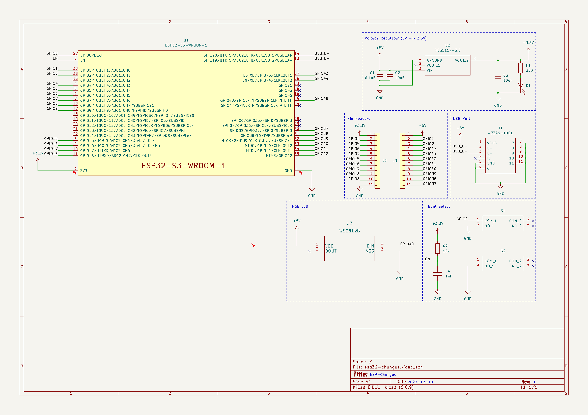
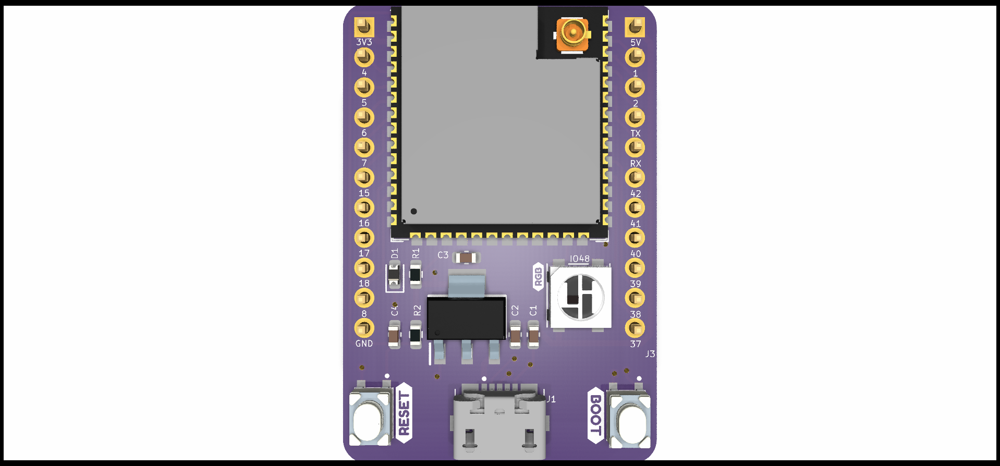
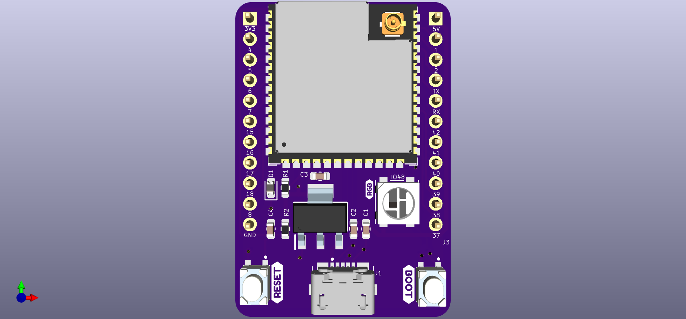

# ESP Chungus

Chungus is an ESP32-S3 development board created as a learning exercise in KiCad.

## Features

- [ESP32-S3](https://www.espressif.com/en/products/socs/esp32-s3) - Dual-core 240Mhz processor with WiFi and Bluetooth
- Breadboard-friendly pinout/dimensions (26.5 x 39 mm)
- 19 GPIOs
- Onboard WS2812B RGB LED
- Onboard Reset and Boot (GPIO0) switches

## Prerequisites

- [Espressif KiCad library](https://github.com/espressif/kicad-libraries)
- [WS2812B KiCad library](https://github.com/madworm/WS2812B.pretty)

## Schematic

## Renders

