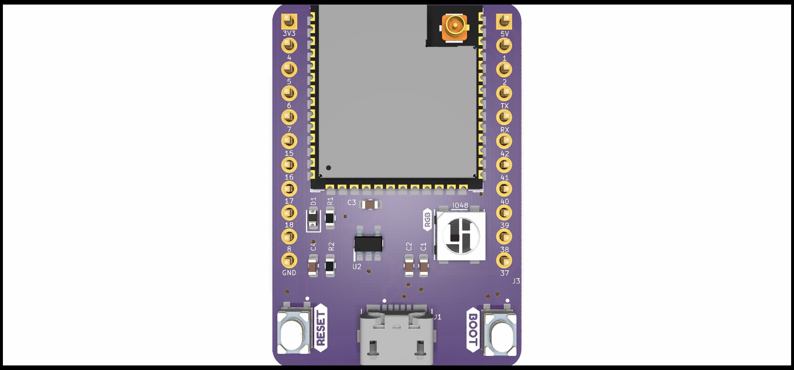
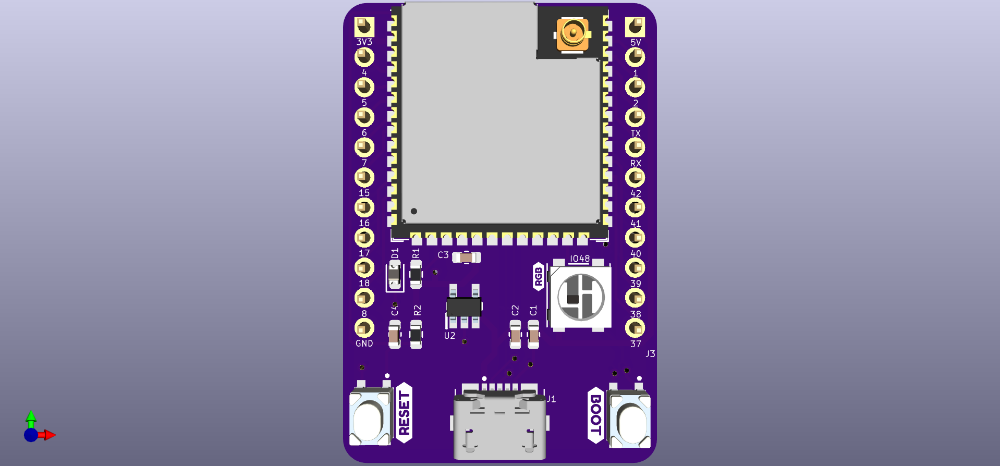

# ESP Chungus

Chungus is an ESP32-S3 development board created as a learning exercise in KiCad.

## Features

- [ESP32-S3](https://www.espressif.com/en/products/socs/esp32-s3) - Dual-core 240Mhz processor with WiFi and Bluetooth
- Breadboard-friendly pinout/dimensions (26.5 x 39 mm)
- 19 GPIOs broken out to pins
- Onboard WS2812B RGB LED connected to GPIO48
- Onboard Reset and Boot (GPIO0) switches

## Libraries

- [Espressif KiCad library](https://github.com/espressif/kicad-libraries)
- [WS2812B KiCad library](https://github.com/madworm/WS2812B.pretty)

## BOM

| Designator | Part                  | Notes               |
| ---------- | --------------------- | ------------------- |
| C1         | 0603 SMD 0.1uF        |                     |
| C2/C3      | 0603 SMD 10uF         |                     |
| C4         | 0603 SMD 1uF          |                     |
| D1         | 0603 SMD LED          |                     |
| J1         | Molex 47346-1001      | Micro-USB connector |
| J2/J3      | 2.54mm Pin Header     |                     |
| R1         | 0603 SMD 330 Ohm      |                     |
| R2         | 0603 SMD 10k Ohm      |                     |
| S1/S2      | PTS526_SM15_SMTR2_LFS | Tactile switch      |
| U1         | ESP32-S3-WROOM-1U     |                     |
| U2         | RT9080-33GJ5          | Voltage regulator   |
| U3         | WS2812B               | RGB LED             |

## Schematic

## Renders

